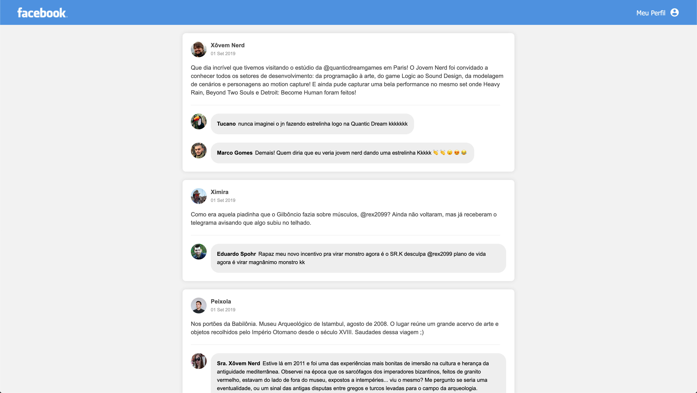

# Facebook Timeline

This is for React study purpose. To get this, I followed an [layout hosted on Figma](https://www.figma.com/file/U3UNBAN3NT47xZ3OyLgmjM/layout?node-id=0%3A2).



### Installing

So, to get this code running, you need to follow the both next steps.

This will install all application dependencies.

```sh
$ yarn
```

And this will run a webpack-dev-server. So, you can modify .js and .css files, save them and it will automagically reload your changes in the browser tab.

```sh
$ yarn dev
```
